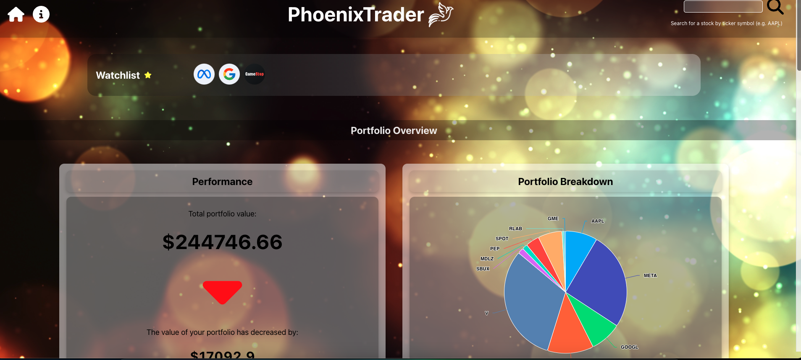
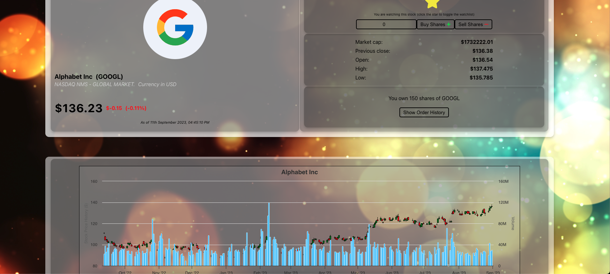

# PhoenixTrader 💸💸💸

## CodeClan - Javascript Group Project

**PhoenixTrader** is a fullstack web application designed to empower users in managing their personal investment portfolios. It integrates live market data to provide real-time insights into portfolio performance.

Key features of PhoenixTrader include:

1. **Portfolio Management**: Keep a record of investment holdings and monitor their performance over time. With the ability to buy and sell stocks at current market prices.

2. **Order History**: Access a complete order history at a glance, enabling the tracking of trading activity and decisions.

3. **Watchlist**: User can stay informed by curating a personalised watchlist of stocks to monitor.

4. **Performance Analytics**: PhoenixTrader harnesses live market data and combines it with the users transaction history to generate comprehensive performance analytics. 

5. **Interactive Charts**: Visualises a portfolio's performance with ease using dynamic piecharts and candlestick charts. These charts leverage the powerful HighCharts library and live data from the FinnHub API, providing clear and actionable insights.

6. **Tailored News Stories**: Users can stay ahead of the curve with news stories tailored to their portfolio or the stocks they are tracking. 


## Built with:

- MongoDB
- Express.js
- React JS
- <a href="https://finnhub.io/docs/api"> FinnHub Api </a>
- Node.js
- Jest

<hr>

<span>


</span>

<hr>

## Screenshots

<div style="text-align: center">
   <span>
    <kbd>
      
    </kbd>
     &emsp;&emsp;
    <kbd>
     
    </kbd>
     <span>
 </div>

<hr>

## Brief:

A local trader has come to you with a portfolio of shares. She wants to be able to analyse it more effectively. She has a small sample data set to give you and would like you to build a Minimum Viable Product that uses the data to display her portfolio so that she can make better decisions.

MVP A user should be able to:
* View total current value
* View individual and total performance trends.
* Retrieve a list of share prices from an external API and allow the user to add shares to her portfolio.
* View a chart of the current values in her portfolio.

Possible Extensions:

* Be able to view current News relating to a specifc share.
* Setup the application for multiple users to use.
* Add a watched list for favourite shares.
* Allow a user to buy and sell shares.

<hr>

Project Setup

Inside Server Folder:

Install required node modules:
```
npm i
```

Run seed file to populate app with template data:
```
npm run seeds
```

Create .env file in the server folder, add the following code and insert the API key from Finnhub:
```
REACT_APP_FINNHUB_API_TOKEN = "your api key"
```

Start the server:
```
npm run server:dev
```

Inside Client Folder:
Install required node modules:
```
npm i
```

Start the app:
```
npm start 
```

<hr> 

## Authors:

<a href="https://github.com/sarahvii/phoenix-app/graphs/contributors">
  
</a>

[Sarah Smith](https://github.com/sarahvii) | [Paul Cumming](https://github.com/WaxenOsprey)


